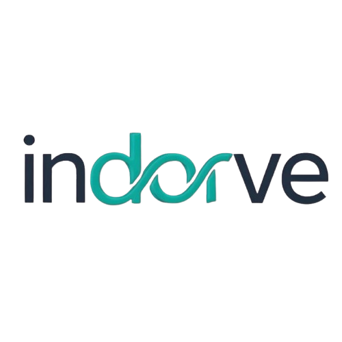

# indorve



## 🚀 Modern, Mobile-First Task & Talent Platform

**indorve** is a beautifully designed, mobile-first web platform connecting clients and students for tasks, projects, and learning opportunities.  
Built with a focus on accessibility, performance, and a stunning, cohesive UI/UX.

---

## ✨ Features

- **Gorgeous Dark Theme** with teal accent branding
- **Mobile-First Responsive Design** (70%+ mobile users optimized)
- **Sticky, Glowing Navbar** with animated hamburger/X menu
- **Radial Gradient & Glassmorphism Effects** for modern depth
- **Animated Hero, Features, Testimonials, and CTA Sections**
- **Accessible, Keyboard-Friendly Navigation**
- **Smooth Transitions & Hover Effects** throughout
- **Custom Scrollbars, Focus Rings, and Selection Styles**
- **Performance-Optimized Fonts** (Inter, system fallbacks, font-display: swap)
- **Consistent Typography** and color palette across all components

---

## 🖼️ Visual Highlights

- **Logo-Only Navbar:** Clean, rectangular PNG logo with soft radial glow
- **Animated Hamburger/X:** Touch-friendly, glowing, and always accessible
- **Full-Screen Mobile Menu:** Centered, easy-to-tap links with smooth slide/fade
- **Section Gradients:** Alternating backgrounds with subtle radial overlays
- **Glassmorphism Cards:** Features, testimonials, and CTAs with soft blur and shadow
- **Gradient Headings:** Modern, eye-catching text for all major sections

---

## 📱 Mobile Experience

- **Sticky Navbar** always accessible, with large touch targets
- **Hamburger Menu** animates to X, overlays content, and is easy to close
- **All content scales beautifully** from desktop to small mobile screens
- **No horizontal scrolling** or overflow issues

---

## ♿ Accessibility & UX

- **Keyboard navigation** and focus styles everywhere
- **Reduced motion support** for users with vestibular disorders
- **High contrast** and legible fonts for all users
- **Semantic HTML** and ARIA labels for screen readers

---

## 🛠️ Tech Stack

- **React** (Vite)
- **CSS Modules** for scoped, maintainable styles
- **Google Fonts (Inter)** with system fallbacks
- **Lucide/Heroicons** (optional, for icons)
- **Modern CSS**: Flexbox, Grid, gradients, transitions, and more

---

## 🚦 Quick Start

```bash
# Install dependencies
npm install

# Start the development server
npm run dev

# Build for production
npm run build
```

---

## 📁 Project Structure

```
src/
  assets/           # Logos and images
  components/       # All major UI components (Navbar, Hero, Features, etc.)
  pages/            # Page-level CSS modules
  App.jsx           # Main app entry
  index.css         # Global styles and font imports
```

---

Let me know if you want to add a live demo link, screenshots, or any other custom touches!

---

## 💡 Customization

- **Change logo:** Replace `src/assets/indorve-logo.png`
- **Edit accent color:** Update teal/blue values in CSS modules
- **Add sections:** Duplicate and style with the same design language

---

## 🙏 Credits

- **Design & UX:** Inspired by the best of modern SaaS and portfolio sites
- **Icons:** [Lucide](https://lucide.dev/) / [Heroicons](https://heroicons.com/)
- **Fonts:** [Inter](https://rsms.me/inter/)

---

## 🌟 Live Demo

> _Coming soon!_

---

## 🦄 Enjoy your beautiful, modern, and accessible web experience with **indorve**!  
Feel free to contribute, fork, or reach out for collaboration.

---
